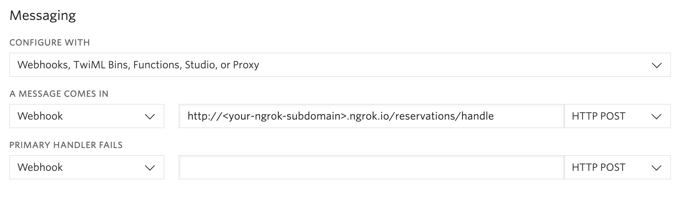

<a href="https://www.twilio.com">
  
</a>

# AirTNG App: Part 1 - Workflow Automation with Twilio - ASP.NET Core MVC
> We are currently in the process of updating this sample template. If you are encountering any issues with the sample, please open an issue at [github.com/twilio-labs/code-exchange/issues](https://github.com/twilio-labs/code-exchange/issues) and we'll try to help you.


Learn how to automate your workflow using Twilio's REST API and Twilio SMS. This example app is a vacation rental site, where the host can confirm a reservation via SMS.

[Read the full tutorial here](https://www.twilio.com/docs/tutorials/walkthrough/workflow-automation/csharp/mvc)!

## Local Development

1. You will need to configure Twilio to send requests to your application when SMS are received.

   You will need to provision at least one Twilio number with sms capabilities so the application's users can make property reservations. You can buy a number [right here](https://www.twilio.com/user/account/phone-numbers/search). Once you have a number you need to configure it to work with your application. Open [the number management page](https://www.twilio.com/user/account/phone-numbers/incoming) and open a number's configuration by clicking on it.

   Remember that the number where you change the _SMS webhook_ must be the same one you set on the `TwilioPhoneNumber` settings.

   

   To start using `ngrok` in our project you'll have execute to the following line in the _command prompt_.

   ```
   ngrok http 5000
   ```

   Keep in mind that our endpoint is:

   ```
   http://<your-ngrok-subdomain>.ngrok.io/Sms/Handle
   ```

1. Clone this repository and `cd` into it.

    ```
    git clone git@github.com:TwilioDevEd/airtng-csharp-dotnet-core.git

    cd airtng-csharp-dotnet-core/AirTNG.Web
    ```

1. Create a new file `twilio.json` and update the content.

   ```json
   {
     "Twilio": {
       "AccountSid": "Your Twilio Account SID",
       "AuthToken": "Your Twilio Auth Token",
       "PhoneNumber": "Your Twilio Phone Number"
     }
   }
   ```

1. Install [EF Core CLI](https://docs.microsoft.com/en-gb/ef/core/what-is-new/ef-core-3.0/breaking-changes#the-ef-core-command-line-tool-dotnet-ef-is-no-longer-part-of-the-net-core-sdk) if it's not already installed.

    ```
    dotnet tool install --global dotnet-ef --version 3.0.0
    ```

1. Build the solution.

    ```
    dotnet build
    ```

1. Create the local DB

    ```
    dotnet ef database update
    ```

1. Run the application.

    ```
    dotnet run
    ```

1. Check it out at [http://localhost:5000](http://localhost:5000)

1. To let our Twilio Phone number use the callback endpoint we exposed, our development server will need to be publicly accessible. [We recommend using ngrok to solve this problem](https://www.twilio.com/blog/2015/09/6-awesome-reasons-to-use-ngrok-when-testing-webhooks.html).

1. Register your webhook with your Twilio Number at `https://www.twilio.com/console/phone-numbers/`. Your webhook url should include the ngrok host from the previous step and should look similar to `https://de9b0f66.ngrok.io/sms/handle`.

That's it!

### Run unit tests

1. cd into AirTNG.Web.Tests project

    ```
    cd airtng-csharp-dotnet-core/AirTNG.Web.Tests
    ```
    
1. Run tests

    ```
    dotnet test
    ```

## Meta

* No warranty expressed or implied. Software is as is. Diggity.
* The CodeExchange repository can be found [here](https://github.com/twilio-labs/code-exchange/).
* [MIT License](http://www.opensource.org/licenses/mit-license.html)
* Lovingly crafted by Twilio Developer Education.
